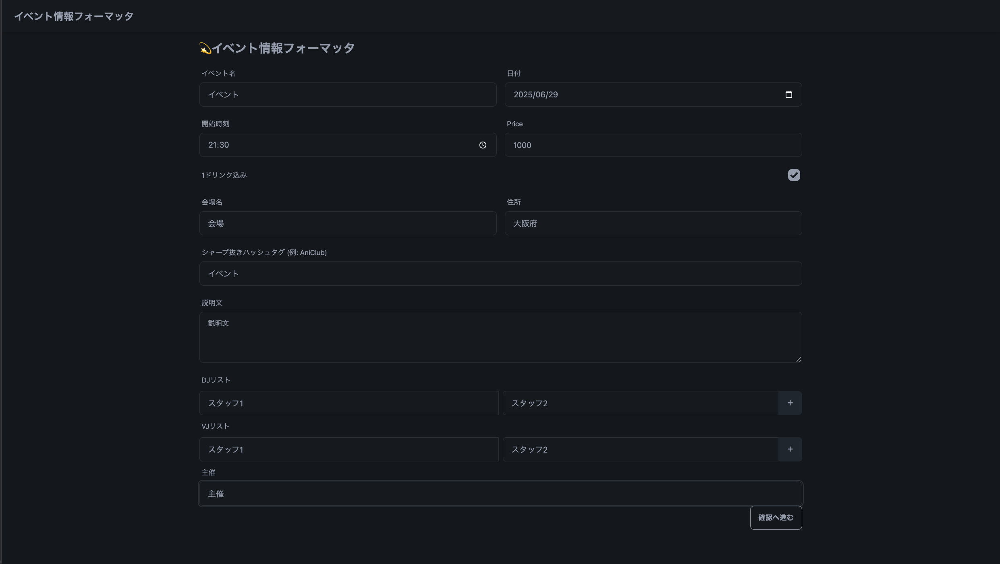
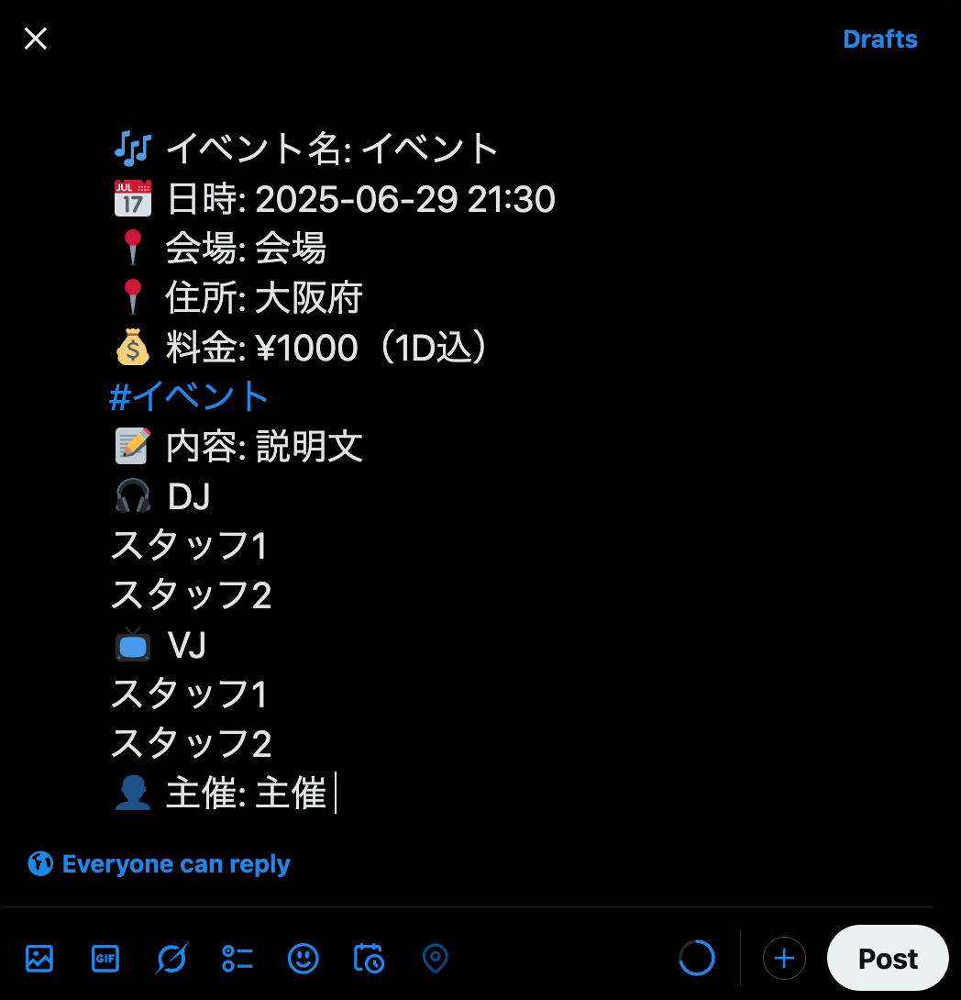

# event-paste
Twitter上のイベントについての情報入力を支援するWebアプリケーションです。

## 目次
- [event-paste](#event-paste)
  - [目次](#目次)
  - [サービス概要](#サービス概要)
  - [開発背景](#開発背景)
  - [セットアップ](#セットアップ)
  - [実行方法](#実行方法)
  - [使用技術と技術選定の理由](#使用技術と技術選定の理由)
  - [将来展望](#将来展望)

## サービス概要
本システムは、DJ イベントの開催情報（日時・会場・出演者など）をフォームで入力すると、X（Twitter）の投稿画面に自動リダイレクトします。

これによって、テンプレート化された宣伝文を簡単にポストすることが可能です。スマホの小さなキーボードでも、長文や記号を含むフォーマットをミスなく投稿できます。





## 開発背景
DJやVJはイベント告知をX上で継続的に行う必要があります。
しかし、スマートフォンから長文かつ複数の情報を毎回入力するのは手間がかかる上、入力ミスの原因になります。

本プロダクトは、そうした宣伝にかかる作業コストを削減するために開発されました。

## ポイント
- Dockerによる環境構築
- Pydanticによるバリデーション
- Github ActionsによるCI/CDパイプラインの構築
  - Ruffによるコード品質チェック
  - pytestによるユニットテスト
  - dockerでのデプロイチェック

## セットアップ
1. このリポジトリをクローンします:
   ```bash
   git clone https://github.com/nanamihajime/event-paste
   cd event-paste
   ```
2. dockerで起動してください
   ```bash
   docker compose up --build
   ```

## 実行方法
セットアップ後、ウェブブラウザで `http://localhost:8000` にアクセスしてください。

## 使用技術と技術選定の理由
| Layer     | Stack                                  | 技術選定の理由                                                                                                           |
|-----------|----------------------------------------|--------------------------------------------------------------------------------------------------------------------------|
| Backend   | FastAPI / Uvicorn / Pydantic / pytest  | 後にNext.jsによるSPA化を予定しており、その場合にできるだけ仕様変更を減少させるため。                                              |
| Frontend  | Jinja2 / Tailwind CSS / DaisyUI        | SPA化しても作り直しや仕様変更が少なく、小規模に開発するため。                                                             |
| CI/CD     | GitHub Actions                         | テストとコード品質チェックを自動化し、開発速度を向上させるため。また、後に自動デプロイやPlaywrightを使用した自動E2Eテストの追加に対応するため。 |
| Container | Docker / Docker Compose                | 環境構築にかかる時間を減少させ、開発速度を向上させるため。                                                                      |

## 将来展望
最終的には、イベント情報を投稿することができ、包括的にイベント情報をチェックすることができるようにします。
- Next.jsによるフロントエンドのSPA化
- cookieでの保存機能
- SQLによるイベント情報投稿機能の追加
- イベント情報のソート機能